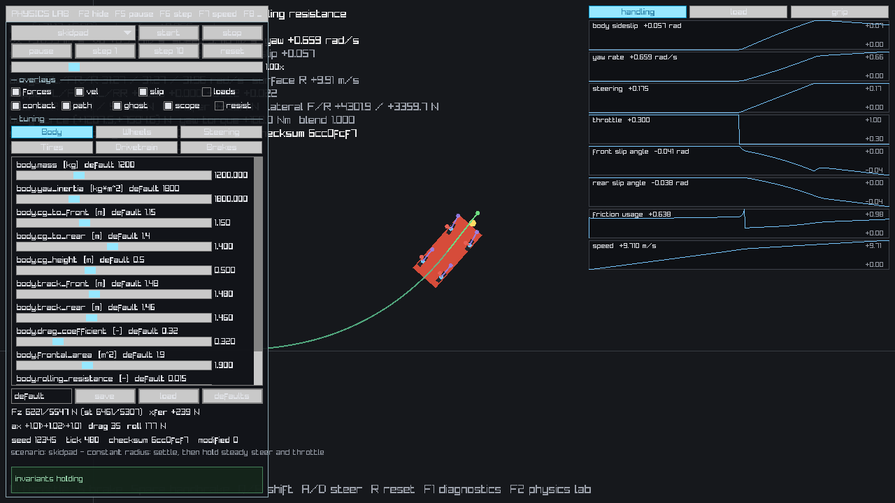

# Drifty

A top-down 2D drift driving simulator in C11 with raylib 6.0. The design goal is a
physically coherent vehicle simulation underneath an arcade presentation layer: the car
initiates, holds, transitions, and recovers a drift because of tire, drivetrain, and
load-transfer behaviour, not because a state machine reaches in and changes forces.

**Windows only.** The supported development environment is **MSYS2 UCRT64**.

- Full specification: [docs/SPEC.md](docs/SPEC.md)
- Reference index: [docs/SOURCES.md](docs/SOURCES.md)
- Agent-facing workflow rules: [AGENTS.md](AGENTS.md)

## Current phase: Phase 3 complete — Load Transfer and Handling Validation

Phases 0–3 are complete. The running game uses a deterministic planar rigid-body vehicle
in SI units:

| System | State |
|--------|-------|
| SI units, coordinate and sign convention | `src/units.h`, `src/config.h` |
| Math helpers (`clampf`, `lerpf`, `smooth_to`, `wrap_angle`, `smoothstep`, `lerp_angle`) | `src/math_utils.h/.c` |
| Fixed 120 Hz timestep with substep cap and backlog-drop counter | `src/timestep.h/.c`, driven by `src/main.c` |
| Held controls vs one-shot commands, consumed exactly once | `src/input.h/.c` |
| Deterministic fixed-tick input recording and playback | `src/replay.h/.c` |
| CSV telemetry writer | `src/telemetry.h/.c` |
| Platform-owned `Game` block, hot-reloadable game module | `src/main.c`, `src/hotreload_windows.c`, `src/game.h/.c` |
| Headless test executable | `tests/physics_tests.c` |
| Windowless hot-reload harness | `tests/hotreload_harness.c` |
| Bounded visual smoke test | `drifty.exe --smoke-test` |
| Canonical vehicle specification/state/diagnostics | `src/vehicle.h/.c` |
| Steering, contact kinematics, tire forces, body integration | `src/physics.h/.c` |
| Normalized nonlinear lateral/longitudinal tire curves and friction ellipse | `src/tire.h/.c` |
| Engine curve, signed gearing, RWD torque, brakes, handbrake, wheel integration | `src/drivetrain.h/.c` |
| Interpolated body, four wheels, HUD, debug vectors | `src/render.h/.c` |

Front and rear lateral force use `-mu * Fz * sin(C * atan(B * alpha))`; longitudinal force
uses the same normalized form with wheel slip ratio. Engine torque is interpolated from a
seven-point curve, multiplied through forward/reverse gearing and final drive, and split
only across the locked rear axle. Service brake torque follows the configured front bias;
the handbrake is rear torque only. Each wheel integrates angular speed from drive, brake,
and tire reaction torque, and longitudinal/lateral forces share one per-wheel ellipse.

The 1.5–3.0 m/s kinematic/dynamic derivative blend remains in place. Phase 3 filters the
previous step's solved body-longitudinal acceleration, transfers axle load from the physical
CG geometry, propagates the dynamic loads into tire capacity, and applies separated
quadratic aerodynamic drag and per-wheel rolling resistance.

The headless runner covers 36 scenarios and 715 checks. Eight reviewed Phase 3 CSV baselines
cover acceleration/braking load transfer, coast-down, skidpad, step steer, lift-off,
transition, and a catchable drift. The deterministic replay checksum is `f0b4580e`.
[docs/PHASE3_VALIDATION.md](docs/PHASE3_VALIDATION.md) records the equations, numerical
handling results, acceptance checklist, tuning decision, and baseline classification.

## Prerequisites (Windows / MSYS2 UCRT64)

1. Install MSYS2 (default root `C:\msys64`):

```bat
winget install -e --id MSYS2.MSYS2 --accept-package-agreements --accept-source-agreements
```

2. Install the project toolchain and raylib 6.0 from the MSYS2 package manager:

```powershell
powershell -ExecutionPolicy Bypass -File scripts\setup_windows.ps1
```

That script is idempotent. It installs (when missing):

- `mingw-w64-ucrt-x86_64-gcc`
- `mingw-w64-ucrt-x86_64-raylib`
- `mingw-w64-ucrt-x86_64-pkgconf`
- `mingw-w64-ucrt-x86_64-binutils`
- `make`

There is **no** Chocolatey GCC path, **no** vendored `vendor/raylib` build, and **no**
manual raylib source compile. raylib comes only from the MSYS2 package.

## Building

`build.bat` is the Windows entry point: it enters MSYS2 UCRT64 and runs `build.sh`.
`build.sh` is the canonical implementation and refuses to run outside UCRT64.
The `Makefile` exposes the same configurations and the same flags.

```bat
build.bat                 rem hot-reload development build
build.bat --release       rem single executable, static raylib, no game.dll
build.bat --tests         rem headless test executable
build.bat --hotreload-harness
build.bat --smoke-test    rem build, then bounded visual smoke test (exits alone)
build.bat --clean
```

Equivalent inside an MSYS2 UCRT64 shell:

```bash
./build.sh
./build.sh --release
./build.sh --tests
./build.sh --hotreload-harness
./build.sh --smoke-test
./build.sh --clean
```

```bash
make debug
make release
make tests
make hotreload-harness
make run-tests
make smoke-test
make clean
make info
```

Every normal build command terminates immediately. Nothing starts a watcher or leaves a
persistent game process running. `--smoke-test` launches the real window, runs a fixed
frame budget, writes a screenshot, and exits.

### Running

```bat
drifty.exe                 rem development build; start once and leave it running
drifty.exe --smoke-test    rem bounded visual verification; exits on its own
drifty_release.exe         rem release build
drifty_tests.exe           rem headless tests; run from the repository root
drifty_hotreload_harness.exe
```

`drifty_tests.exe` writes CSV telemetry to `telemetry/` relative to the working directory,
so run it from the repository root. It accepts `--list`, `--scenario NAME`, and `-v`.

## Linkage

### Development (hot reload)

`drifty.exe` and `build/game.dll` both link the MSYS2 **shared** raylib import library and
therefore both import `libraylib.dll` (MSYS2's DLL name). The build copies:

- `libraylib.dll`
- `glfw3.dll` (required by `libraylib.dll`)

next to the executables so launching from Explorer or a normal terminal does not depend on
a hand-edited `PATH`. Those DLLs are generated and gitignored.

Never compile raylib sources into `game.dll`.

### Release

`drifty_release.exe` compiles platform + game into one executable with `DRIFTY_HOT_RELOAD`
undefined. It links `libraylib.a` statically and does **not** import `libraylib.dll` or
`game.dll`. With the current MSYS2 raylib package, the static archive still references
shared GLFW, so `glfw3.dll` is copied next to the release executable. That is a package
limitation, not a project DLL.

### Verify imports

```bash
objdump -p drifty.exe | grep -i "DLL Name"
objdump -p build/game.dll | grep -i "DLL Name"
objdump -p drifty_tests.exe | grep -i "DLL Name"
objdump -p drifty_release.exe | grep -i "DLL Name"
```

Expected: development artifacts import `libraylib.dll`; tests and release do not.

## Hot-reload workflow

The game is a thin platform layer (`drifty.exe`) plus a hot-reloadable game module
(`build/game.dll`). The platform layer owns the window, the raylib context, the `Game`
allocation, and the fixed-timestep loop. Everything else lives in the module.

1. Run `drifty.exe` once and leave it open.
2. Edit game code.
3. Run `build.bat` (or `./build.sh` in UCRT64). It rebuilds the module always, rebuilds the
   executable only when it is not already running, and returns in well under a second.
4. The running game notices the new module and swaps it in, keeping its position, counters,
   and checksum.

The loader never unloads a working module until a replacement has been proven good. A
compile error cannot close the running game.

Automated validation without leaving `drifty.exe` running:

```bat
build.bat --hotreload-harness
drifty_hotreload_harness.exe
```

Or the fuller script (harness + failed-compile preservation):

```bash
# inside MSYS2 UCRT64, from the repo root
./scripts/validate_hotreload.sh
```

### When a restart is required

Hot reload cannot handle these. Restart `drifty.exe` after:

- A change to the layout of `Game` or anything it contains.
- A change to `src/main.c`, `src/timestep.c`, or `src/hotreload_windows.c`.
- A change to `GAME_ENTRY_POINTS`.

### Reload-safety rules for game code

- No pointer stored in `Game`, or reachable from it, may point into the module's code or
  static data.
- No function pointers in persistent state.
- The `Game` block is allocated and owned by the platform layer. Never declare
  `static Game game;` inside the module.
- Anything raylib tracks is released in `game_pre_reload` and re-acquired in
  `game_post_reload`.

## Development tooling

The game itself stays plain C and raylib. Around it sits a development shell — an in-game
Physics Lab, a replay inspector, telemetry reports, failure bundles, and one command per
operation. [docs/DEVTOOLS.md](docs/DEVTOOLS.md) is the guide; [docs/CI.md](docs/CI.md) covers
the workflows and required checks.

```bash
mk test                 # fast scenarios          mk verify        analysis + tests + regression
mk scenario NAME=skidpad
mk report NAME=skidpad  # self-contained HTML report with plots and a baseline comparison
mk ci                   # exactly what the required CI checks run
```

`mk.bat` enters MSYS2 UCRT64 for you; from a UCRT64 shell use `make <target>`. Every target
terminates on its own except `mk run`, which launches the game.

Press **F2** in the running game for the Physics Lab: scenario selector, pause and single
step, live sliders for all 46 tunables with their defaults and units, tuning profiles,
overlay toggles, an eight-channel scope with a baseline ghost, and an invariant panel. **F3**
opens the replay inspector.



Every tunable is defined once, in `src/dev_params.c`, and that one definition generates the
sliders, the profile format, the telemetry metadata, and
[docs/PARAMETERS.md](docs/PARAMETERS.md).

## Known limitations

- **Changing the `Game` struct layout requires a restart.** Inherent to the technique.
- **Restart `drifty.exe` once for the development-tool layout.** `Game` now carries the
  Physics Lab's state (`DevState`); restart the executable once after updating, and ordinary
  module-only hot reload preserves state as usual after that.
- **Restart `drifty.exe` once for the Phase 2 layout.** Canonical vehicle diagnostics and
  reverse gearing changed persistent structure layout; normal code-only hot reload works
  after that restart.
- **Linux gameplay remains unsupported.** Linux builds are headless CI support only and are
  not a substitute for the MSYS2 UCRT64 gameplay build.
- **Release still needs `glfw3.dll`.** The MSYS2 `libraylib.a` was built against shared
  GLFW (`__imp_glfw*`), so a fully static single-file release without any third-party DLL
  is blocked by that package layout. `libraylib.dll` and `game.dll` are not required.

## Layout

```
Makefile, build.sh, build.bat   build entry points; all terminate immediately
mk.bat                          run a Makefile target inside MSYS2 UCRT64 from cmd.exe
scripts/setup_windows.ps1       idempotent MSYS2 UCRT64 bootstrap
scripts/validate_hotreload.sh   harness + failed-compile preservation
scripts/setup_ruleset.sh        branch ruleset via gh; prints unless given --apply
docs/SPEC.md, docs/SOURCES.md   specification and reference index
docs/DEVTOOLS.md                the development shell: lab, inspector, reports, targets
docs/CI.md                      workflows, required checks, and why the gates are shaped so
docs/PARAMETERS.md              generated from the tunable registry
src/main.c                      platform layer: window, Game allocation, fixed-timestep loop
src/timestep.h/.c               the accumulator, isolated so the harness can assert it
src/hotreload.h                 GAME_ENTRY_POINTS, the one authoritative entry-point list
src/hotreload_windows.c         LoadLibrary / GetProcAddress loader
src/game.h/.c                   the Game block and the reloadable entry points
src/config.h                    Phase 0–3 constants, every physical value unit-bearing
src/units.h                     world<->render conversion and the coordinate convention
src/math_utils.h/.c             scalar helpers raymath.h does not provide
src/input.h/.c                  held controls and one-shot commands
src/replay.h/.c                 deterministic fixed-tick input timeline
src/telemetry.h/.c              CSV row writer, no raylib dependency
src/vehicle.h/.c                canonical vehicle data and initialization
src/tire.h/.c                   pure nonlinear curves, slip ratio, combined-friction limit
src/drivetrain.h/.c             pure engine/gearing/torque/wheel dynamics
src/physics.h/.c                pure Phase 3 integration and fixed-update owner
src/render.h/.c                 interpolation, vehicle rendering, HUD, vectors, tire plots
src/dev_params.h/.c             the one tunable registry: sliders, profiles, docs, metadata
src/dev_scenario.h/.c           scripted maneuvers, shared by the lab and the headless runner
src/dev_state.h/.c              lab state inside Game: scope, trajectory, invariant monitor
src/dev_lab.h/.c                the raygui Physics Lab (development builds only)
src/dev_replay.h/.c             durable replay timelines and the inspector's event markers
src/failure_bundle.h/.c         reproducible failure directories
src/profile.h/.c                zone instrumentation: off, built-in timers, or Tracy
src/build_info.h                commit, branch, dirty flag, compiler, flags, platform
tests/physics_tests.c           headless scenario runner
tests/hotreload_harness.c       windowless hot-reload validation
tests/baselines/                reviewed deterministic scenario CSV baselines
tests/visual/                   deterministic scene baselines and the RMSE gate
tools/*.py                      telemetry comparison, plots, summaries, HTML reports
fuzz/fuzz_*.c                   libFuzzer targets for the parsers and the tire functions
third_party/raygui/             vendored raygui, development builds only
telemetry/                      generated CSV / smoke screenshot (gitignored)
artifacts/                      reports, screenshots, failure bundles (gitignored)
```
